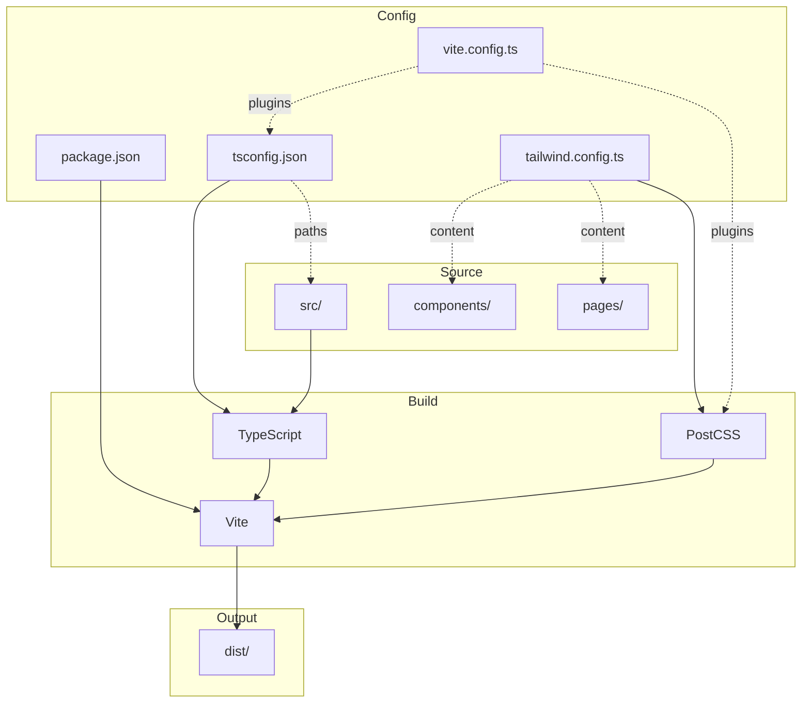

# /sync-stack

**Wire your project together and generate specs for HOW to build it.**

/init-project defines WHAT you're building. /sync-stack handles HOW:
- Installs dependencies and wires configs together
- Verifies everything is connected properly
- Generates coding specs from official docs
- Creates a wiring diagram showing how pieces connect

---

## Usage

```
/sync-stack              # Full setup (install, wire, verify, generate specs)
/sync-stack prisma       # Add a specific dependency and update wiring
/sync-stack --verify     # Just verify wiring, don't regenerate specs
```

---

## Core Principle

**All spec categories are treated the same.** Coding specs, config specs, architecture specs - all get:
1. Verified against official docs (context7 or official sites)
2. Populated with real content, not placeholders
3. If not configured, prompt to set it up

No category is "just project conventions" that skips verification.

---

## What This Does

### 1. Project Setup
- Detects package manager (npm, yarn, pnpm, bun)
- Installs dependencies if lock file missing
- Creates config files that reference each other correctly

### 2. Wiring Verification
- Checks configs are connected (tsconfig paths, tailwind content, vite plugins)
- Validates peer dependencies are satisfied
- Ensures build pipeline will work

### 3. Spec Generation
Researches your stack via context7 and generates specs with **real patterns from official docs**. This applies to ALL categories - coding, config, architecture, design.

| Category | What it contains | Source |
|----------|------------------|--------|
| `coding/` | Language and library patterns | Official docs (React, TS, etc.) |
| `architecture/` | File structure, wiring diagram | Framework docs + detected config |
| `design/` | Implementation patterns for design system | Styling framework docs |
| `documentation/` | Code comments, docstrings | Language conventions (TSDoc, etc.) |
| `config/` | Git, testing, deployment, env | Detected from project files |

### 4. Wiring Diagram
Generates `.claude/specs/architecture/wiring.md` with mermaid diagram showing:
- Dependencies and their relationships
- Config file connections
- Build pipeline flow

---

## STEP 1: Read Existing Specs

First, read all existing spec files to understand current configuration.

```bash
# Find all spec files
find .claude/specs -name "*.md" -o -name "*.yaml" 2>/dev/null
```

**Read each file found.** This gives you:
- Current stack configuration (stack-config.yaml)
- Existing coding patterns (coding/*.md)
- Config settings (config/*.md)
- Any custom specs (architecture/, design/, documentation/, custom/)

**Note what exists** so you can update rather than overwrite, and preserve user customizations.

---

## STEP 2: Check Design System (UI Projects)

**Before generating specs, verify design decisions are established for UI projects.**

Determine if project has UI:
- Solution type is website, web app, mobile app, or desktop app
- Has component files (.tsx, .vue, .svelte, etc.)
- Has styling config (tailwind.config.*, styles/, css files)

If UI project, check for design system:

```bash
# Check for design system spec
ls .claude/specs/design/design-system.md 2>/dev/null
```

**If design system doesn't exist:**

```
DESIGN SYSTEM REQUIRED

This project has a UI but no design system is defined.

Design decisions (colors, typography, component patterns) must be established
before generating technical specs. Otherwise, specs can't enforce visual consistency.

Options:
1. Run /init-project to define design system now
2. Create .claude/specs/design/design-system.md manually
3. Skip design specs (not recommended for production UI)

How do you want to proceed?
```

**WAIT FOR USER RESPONSE** before continuing.

If user chooses option 1, run /init-project's design section only, then continue.

---

## STEP 3: Project Setup (New Projects)

**If this is a new project without dependencies installed, set it up.**

### Check if setup needed

```bash
# Check for lock files
ls package-lock.json yarn.lock pnpm-lock.yaml bun.lockb 2>/dev/null
```

**If no lock file exists but package.json exists:**

```
PROJECT NOT INSTALLED

Dependencies are defined but not installed. This project needs setup.

Detected package manager: [npm/yarn/pnpm/bun based on config or preference]

Install dependencies and wire configs? (yes/no)
```

**WAIT FOR USER RESPONSE**

### If user confirms, run setup:

1. Install dependencies:
```bash
[npm install / yarn / pnpm install / bun install]
```

2. Check for missing peer dependencies and install if needed

3. Verify lock file was created

**If lock file exists:** Skip to Step 4.

---

## STEP 4: Detect Stack

Check for config files to detect the tech stack:

| File | Detects |
|------|---------|
| package.json | Node.js + dependencies (React, Vue, Svelte, etc.) |
| tsconfig.json | TypeScript |
| next.config.* | Next.js |
| nuxt.config.* | Nuxt |
| svelte.config.* | SvelteKit |
| astro.config.* | Astro |
| vite.config.* | Vite (check plugins for framework) |
| tailwind.config.* | Tailwind CSS |
| vitest.config.* / jest.config.* | Testing framework |
| .eslintrc.* / eslint.config.* | ESLint |
| .prettierrc.* | Prettier |
| prisma/schema.prisma | Prisma |
| drizzle.config.* | Drizzle |
| pyproject.toml / requirements.txt | Python |
| Cargo.toml | Rust |
| go.mod | Go |
| Gemfile | Ruby |

**If argument provided** (e.g., `/sync-stack prisma`): Skip detection, focus on that dependency.

**If no code exists:** Ask what they're building, suggest a stack.

**Show detected stack and ask to confirm:**

```
DETECTED STACK

Framework: Next.js 14
Language: TypeScript
Styling: Tailwind CSS
Testing: Vitest
Package Manager: pnpm

Dependencies to generate specs for:
- next
- typescript
- tailwind
- vitest

Confirm? (yes / modify)
```

**WAIT FOR USER RESPONSE**

---

## STEP 5: Research Each Technology

For each confirmed technology, research official patterns.

### REQUIRED: Use context7 MCP

```
Use the context7 MCP tool to fetch documentation for [technology].
Look for: project structure, naming conventions, common patterns, anti-patterns.
```

### If context7 fails

**STOP and notify the user.** Do not silently fall back to web search.

```
CONTEXT7 UNAVAILABLE

context7 returned an error for [technology]:
[error message]

Options:
1. Retry context7
2. Skip this technology for now
3. Use WebFetch on official docs (e.g., react.dev, docs.astro.build)

Note: Web search is NOT acceptable for core framework patterns.
Official documentation only.
```

**WAIT FOR USER RESPONSE** before proceeding.

### WebFetch (only with user approval)

If user approves, use WebFetch on official documentation sites only:
- react.dev (not random blogs)
- docs.astro.build (not tutorials)
- tailwindcss.com/docs (not Medium articles)

Never use general WebSearch for framework patterns.

### Extract from research (categorized by spec type):

**For coding specs:**
- Component/function patterns
- Import style
- Error handling patterns
- Common gotchas to avoid

**For architecture specs:**
- File/folder conventions
- Project structure requirements
- Module organization

**For design specs:**
- Design token patterns (if using Tailwind, styled-components, etc.)
- Component styling conventions
- Theme structure

**For documentation specs:**
- Code comment conventions
- Docstring formats
- README patterns

---

## STEP 6: Scan Existing Code

If the project has existing code, scan for patterns to preserve.

### What to scan:

**File structure:**
```bash
find src -type f -name "*.tsx" -o -name "*.ts" | head -20
```

**Component patterns:**
```bash
grep -r "export default function\|export const\|export function" src --include="*.tsx" | head -10
```

**Import style:**
```bash
grep -r "^import" src --include="*.ts" --include="*.tsx" | head -10
```

**Test structure:**
```bash
find . -name "*.test.*" -o -name "*.spec.*" | head -10
```

### Compare with research:
- If existing patterns match best practices: document them as-is
- If existing patterns differ: note the project's convention (consistency > best practice)
- If no existing code: use researched best practices

---

## STEP 7: Update Config Specs

Config specs follow the same principle as coding specs: verify against official docs, no placeholders.

### Read existing templates

```bash
ls .claude/specs/config/
```

Read each file: version-control.md, deployment.md, environment.md, testing.md

### For each config spec:
1. Detect what's configured in the project
2. If configured: fetch official docs (e.g., Vitest docs, Cloudflare docs), verify spec accuracy
3. If not configured: prompt to set it up with recommendation based on stack

### Update version-control.md

Detect from project:
```bash
# Check recent commits for format
git log --oneline -10

# Check branch naming
git branch -a | head -10

# Check for hooks
ls .husky 2>/dev/null || ls .git/hooks 2>/dev/null
```

Update the template with:
- Actual commit message format used
- Branch naming convention
- Any pre-commit hooks configured

### Update testing.md

Detect from project:
```bash
# Check package.json for test scripts
grep -A5 '"scripts"' package.json | grep test

# Check test directory structure
find . -name "*.test.*" -o -name "*.spec.*" | head -5

# Check test config
ls vitest.config.* jest.config.* 2>/dev/null
```

**If no testing framework detected:**
```
TESTING NOT CONFIGURED

No test framework detected. Recommendation for this stack:
- [Framework]: Vitest (fast, Vite-native)
- [Components]: @testing-library/react
- [Environment]: jsdom

Add testing? (yes / skip)
```

If yes: install packages, fetch Vitest docs via context7, generate real testing spec.

**If testing framework detected:**
- Fetch docs for detected framework via context7
- Update spec with verified patterns
- Include test file location, commands, coverage setup

### Update deployment.md

Detect from project:
```bash
# Check for deployment configs
ls vercel.json netlify.toml fly.toml render.yaml Dockerfile docker-compose.yml 2>/dev/null
```

**If deployment platform detected:**
- Fetch platform docs (Cloudflare, Vercel, Netlify, etc.) via context7 or WebFetch
- Verify spec matches current platform requirements
- Update with build commands, environment setup, platform-specific patterns

**If no deployment config:**
- Note it's not configured
- Suggest platforms based on stack (Cloudflare for static, Vercel for Next.js, etc.)

### Update environment.md

Detect from project:
```bash
# Check for env examples
cat .env.example 2>/dev/null || cat .env.sample 2>/dev/null
```

Update the template with:
- Required environment variables
- Variable naming conventions

---

## STEP 8: Generate All Specs

**Use the research from Step 3 to fill in actual content.** Don't create empty templates. Every spec should contain real patterns from official docs.

### 8a: Ask which categories to generate

```
SPEC CATEGORIES

Based on your stack, these specs can be generated:

[x] coding/        - React, TypeScript, Vitest patterns
[x] architecture/  - Next.js file structure conventions
[x] design/        - Tailwind design tokens
[ ] documentation/ - No specific conventions detected

Generate all? (yes / customize)
```

### 8b: Generate coding specs

For each technology with code patterns, create `[technology]-specs.md` with **actual patterns from research**:

```markdown
# React Specs

Source: https://react.dev/learn

## Patterns

### Component Declaration
Use function components with TypeScript.

```tsx
interface ButtonProps {
  label: string;
  onClick: () => void;
}

export function Button({ label, onClick }: ButtonProps) {
  return <button onClick={onClick}>{label}</button>;
}
```

### Hooks
- Call hooks at the top level, not inside conditions
- Custom hooks must start with "use"

## Anti-Patterns

- Don't use `any` type - use proper TypeScript types
- Don't mutate state directly - use setState

## Project-Specific

[Patterns found in existing code that differ from defaults]
```

### 8c: Generate architecture specs

If framework has file structure conventions, create or update `architecture/project-structure.md` with **actual conventions from docs**:

- If file exists (from /init-project): add framework-specific section
- If file doesn't exist: create it with framework conventions

```markdown
# Project Structure

Source: https://nextjs.org/docs/app/building-your-application/routing

## Directory Layout

```
app/
├── layout.tsx          # Root layout (required)
├── page.tsx            # Home page
├── globals.css         # Global styles
├── api/                # API routes
│   └── route.ts
└── [slug]/             # Dynamic routes
    └── page.tsx
```

## Conventions

### Page files
- `page.tsx` - Publicly accessible page
- `layout.tsx` - Shared UI for segment and children
- `loading.tsx` - Loading UI
- `error.tsx` - Error UI

### Component organization
- Colocate components with their routes when route-specific
- Shared components go in `components/` at project root

## Anti-Patterns

- Don't put API logic in page components - use route handlers
- Don't import server components into client components
```

### 8d: Generate design implementation specs

**The design system (colors, typography, component styles) should already exist from /init-project.**

This step generates technical specs for IMPLEMENTING that design system using the detected styling framework.

Read the existing design system:
```bash
cat .claude/specs/design/design-system.md
```

Then create `design/[framework]-implementation.md` with patterns for applying the design system:

```markdown
# [Styling Framework] Implementation

Source: [framework docs] + .claude/specs/design/design-system.md

## How to Apply Design Tokens

### Colors
[How to reference design system colors in this framework]
- Tailwind: Use custom theme colors defined in tailwind.config
- CSS Modules: Import from design tokens CSS file
- styled-components: Use theme provider values

### Typography
[How to apply typography decisions in this framework]

### Spacing
[How to apply spacing rhythm in this framework]

## Component Patterns

[Framework-specific patterns for implementing the component styles defined in design-system.md]

### Buttons
```[code example showing how to build a button matching design system]```

### Cards
```[code example showing how to build a card matching design system]```

## Anti-Patterns

- [Framework-specific things to avoid]
- Always reference design system tokens, never hardcode values
```

**If design-system.md doesn't exist:** STEP 2 should have caught this. If somehow skipped, prompt user to define design system before generating implementation specs.

### 8e: Generate documentation specs

If language/framework has doc conventions, create `code-comments.md` with **actual conventions**:

```markdown
# Code Comments

Source: https://tsdoc.org/

## When to Comment

- Public API functions - always
- Complex algorithms - explain the why
- Workarounds - link to issue/reason

## Docstring Format

Use TSDoc for TypeScript:

```tsx
/**
 * Fetches user data from the API.
 * @param userId - The unique identifier for the user
 * @returns The user object or null if not found
 * @throws {ApiError} When the API request fails
 */
export async function getUser(userId: string): Promise<User | null> {
```

## Anti-Patterns

- Don't comment obvious code (`// increment i` above `i++`)
- Don't leave TODO comments without issue links
```

### Only create what's needed

- Skip `architecture/` if no framework-specific structure (vanilla JS/TS)
- Skip `design/` if no styling framework (just plain CSS)
- Skip `documentation/` if no specific conventions found in docs
- **Never create empty templates** - only create specs with real content from research

---

## STEP 9: Generate Wiring Diagram

Generate `.claude/specs/architecture/wiring.md` with a mermaid diagram showing how the project is wired together.

### What to include

1. **Dependencies** - Key packages and their relationships
2. **Config connections** - What config files reference each other
3. **Build pipeline** - How source becomes output
4. **Data flow** - How data moves through the app (if applicable)

### Generate the diagram

```markdown
# Project Wiring

## Overview Diagram



## Config Dependencies

| Config File | Depends On | Referenced By |
|-------------|------------|---------------|
| tsconfig.json | - | vite.config.ts |
| tailwind.config.ts | - | postcss.config.js |
| vite.config.ts | tsconfig.json, tailwind | package.json scripts |

## Key Connections

- **TypeScript paths** → Must match actual directory structure
- **Tailwind content** → Must include all files with classes
- **Vite plugins** → Must be installed and configured in order
```

### Adapt to actual stack

The above is an example. Generate a diagram that reflects THIS project's actual:
- Framework (Next.js, Astro, Vite, etc.)
- Language (TypeScript, JavaScript, etc.)
- Styling (Tailwind, CSS Modules, etc.)
- Build tools
- Config files present

---

## STEP 10: Verify Wiring

**Check that all configs are actually connected properly.**

### 10a: TypeScript paths

```bash
# Check tsconfig paths exist
cat tsconfig.json | jq '.compilerOptions.paths'
# Verify those paths resolve to actual directories
```

### 10b: Tailwind content

```bash
# Check tailwind content array
cat tailwind.config.* | grep -A5 "content"
# Verify patterns match actual file locations
```

### 10c: Build script

```bash
# Try a build
npm run build 2>&1 | head -20
```

### 10d: Peer dependencies

```bash
# Check for peer dep warnings
npm ls 2>&1 | grep -i "peer"
```

### Report issues

If any verification fails:

```
WIRING ISSUES DETECTED

1. [Issue description]
   - Expected: [what should be]
   - Found: [what is]
   - Fix: [how to fix]

2. [Next issue...]

Fix these issues? (yes/no)
```

**WAIT FOR USER RESPONSE** before making fixes.

---

## STEP 11: Update stack-config.yaml

Update `.claude/specs/stack-config.yaml` with:

1. **Stack details** - framework, language, styling, testing, package_manager
2. **Specs list** - all generated spec files across all categories

Example update:

```yaml
stack:
  framework: "Next.js"
  framework_version: "14"
  language: "TypeScript"
  styling: "Tailwind CSS"
  testing: "Vitest"
  package_manager: "pnpm"

specs:
  coding:
    - nextjs-specs
    - typescript-specs
    - tailwind-specs
    - vitest-specs
  architecture:
    - project-structure
  design:
    - design-system
  documentation:
    - code-comments
  config:
    - version-control
    - deployment
    - environment
    - testing
```

Only include categories that have specs. Don't add empty categories.

---

## STEP 12: Summary

Show what was created/updated:

```
SYNC COMPLETE

Stack: Next.js 14 + TypeScript + Tailwind + Vitest
Package manager: pnpm
Lock file: pnpm-lock.yaml ✓

Setup:
- Dependencies installed (147 packages)
- No peer dependency issues

Wiring verification:
- TypeScript paths ✓
- Tailwind content ✓
- Build script ✓
- All configs connected properly

Specs generated:
- config/version-control.md
- config/testing.md
- config/deployment.md
- config/environment.md
- coding/nextjs-specs.md
- coding/typescript-specs.md
- coding/tailwind-specs.md
- coding/vitest-specs.md
- architecture/project-structure.md
- architecture/wiring.md (with mermaid diagram)
- design/tailwind-implementation.md

Updated: stack-config.yaml

Next steps:
- Review wiring diagram in architecture/wiring.md
- Review specs in .claude/specs/
- Run /start-task to build with these specs enforced
```

### Save state for pivot detection

After successful sync, save a hash of key files for detecting future changes:

```bash
# Create .claude/specs/.sync-state.json
{
  "lastSync": "2024-01-15T10:30:00Z",
  "hashes": {
    "package.json": "[md5 hash]",
    "package-lock.json": "[md5 hash]",
    "tsconfig.json": "[md5 hash]",
    "tailwind.config.ts": "[md5 hash]"
  }
}
```

This allows future `/sync-stack` runs to detect what changed and prompt for updates.

---

## Error Handling

### context7 fails (network error, timeout)
STOP. Notify user. Do not proceed with web search. Ask user how to proceed.

### context7 has no docs for [tech]
Use WebFetch on official docs site only (with user approval). Note source in spec file.

### Can't detect stack
Ask user directly: "What framework/language are you using?"

### Conflicting patterns in existing code
Note the inconsistency. Ask user which pattern to standardize on.

### Spec already exists
Ask: "Update existing [tech]-specs.md? (yes/skip)"

---

## Adding a Single Dependency

When run as `/sync-stack [dependency]`:

1. Skip full stack detection
2. Research just that dependency
3. Check for existing patterns using it
4. Generate/update the coding spec for that dependency
5. If the dependency has architecture implications (e.g., Prisma schema location), update architecture specs too
6. Add to stack-config.yaml specs list

**Note:** Single dependency mode focuses on coding specs. Run full `/sync-stack` to regenerate architecture/design/documentation specs.

---

## How Specs Are Used

After running `/sync-stack`:

1. User runs `/start-task`
2. Claude loads `stack-config.yaml`
3. Reads all files listed under `specs:`
4. Shows patterns that will be enforced
5. User approves
6. Claude implements following specs
7. Runs quality gates

**Your specs become the rules.**
