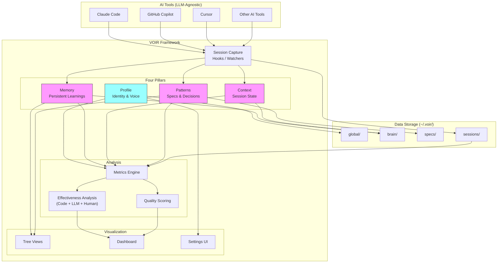
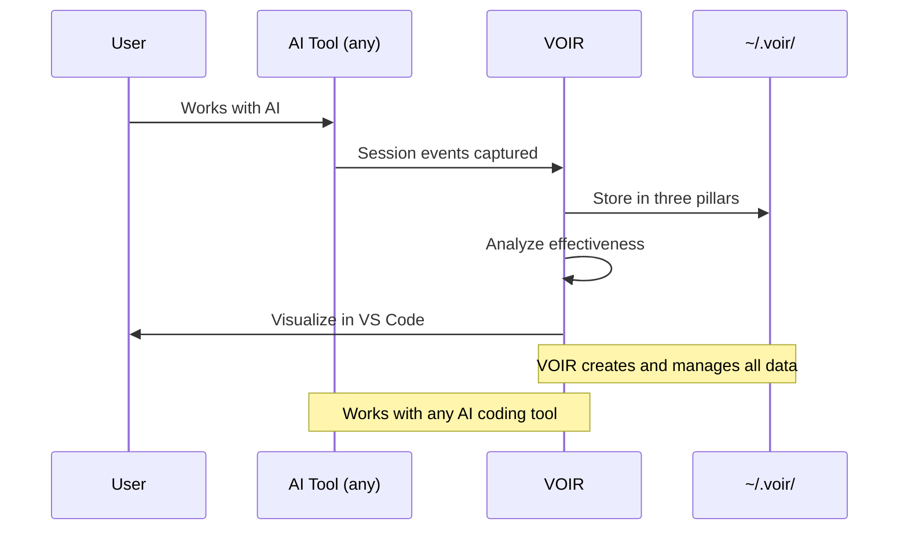
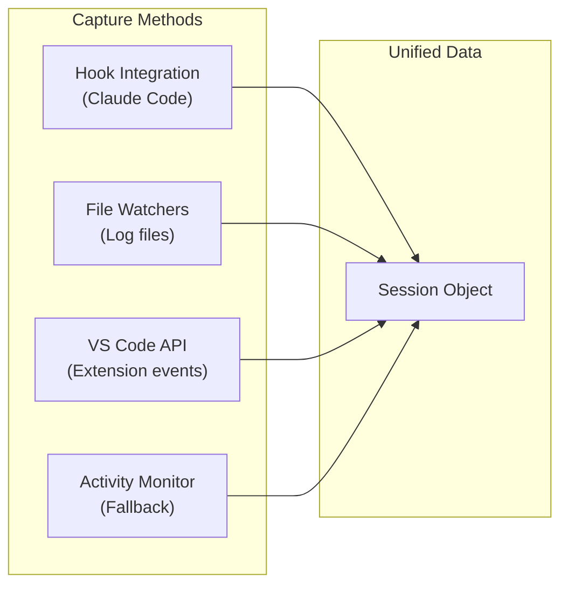
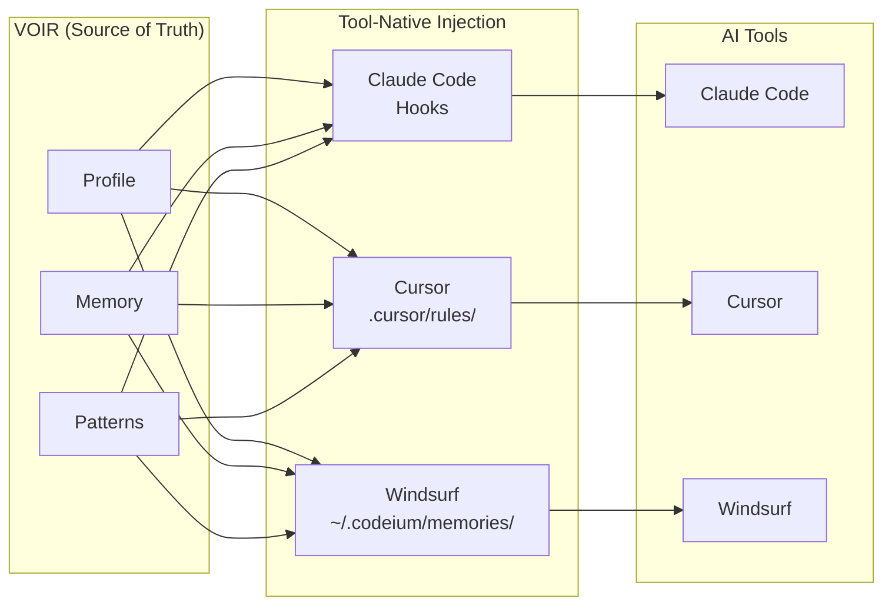
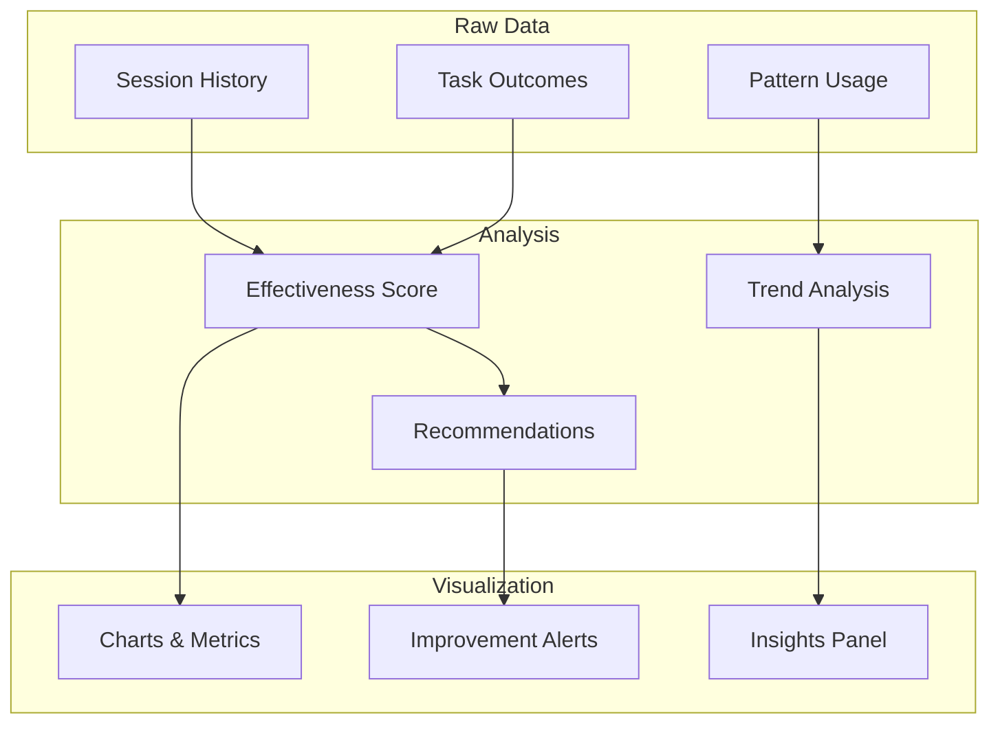
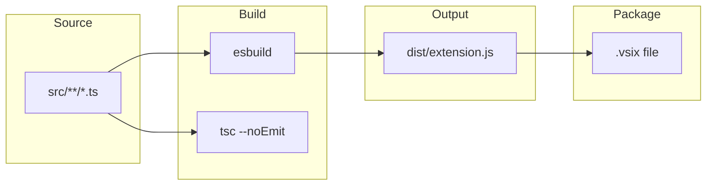
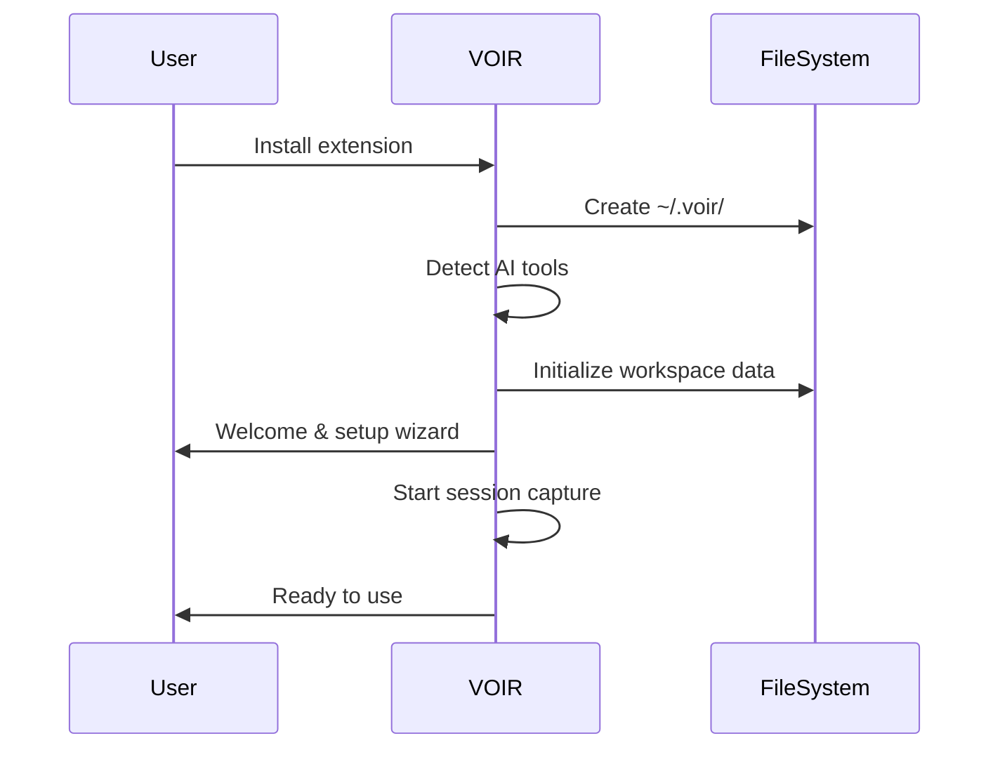

# Project Wiring

## What VOIR Is

VOIR is an **LLM-agnostic framework** packaged as a VS Code extension. It:

1. **Creates and manages** the data infrastructure (brain, specs, memory)
2. **Captures** what LLMs are doing during coding sessions
3. **Analyzes** effectiveness and patterns
4. **Visualizes** everything through VS Code UI

VOIR works with any AI coding tool: Claude Code, Copilot, Cursor, Windsurf, etc.

---

## System Architecture



---

## Data Architecture

### Storage Location

```
~/.voir/                              # VOIR's data directory
├── config.json                       # Global settings
├── global/                           # Profile pillar (cross-workspace)
│   ├── profile.md                    # Identity, goals, preferences
│   ├── voice.md                      # Writing style rules
│   ├── learnings.md                  # Cross-workspace learnings
│   └── analytics/                    # Aggregated metrics
│
└── workspaces/
    └── {workspace-hash}/             # Per-workspace data
        ├── brain/                    # Memory + Context pillars
        │   ├── memory.json           # Persistent learnings
        │   ├── context.json          # Current session state
        │   └── sessions/             # Session history
        │       └── {session-id}.jsonl
        ├── specs/                    # Patterns pillar
        │   ├── stack-config.yaml     # Tech stack
        │   ├── coding/               # Coding patterns
        │   ├── architecture/         # Architecture decisions
        │   └── design/               # Design system
        └── analytics/
            ├── effectiveness.json    # Effectiveness metrics
            └── patterns.json         # Detected patterns
```

**Design rationale:**
- **Profile in global/**: Identity applies across all workspaces
- **Memory in workspace/brain/**: Learnings are project-specific (but can merge to global)
- **Context in workspace/brain/**: Session state is always workspace-specific
- **Patterns in workspace/specs/**: Coding patterns are project-specific

### The Four Pillars

| Pillar | What It Stores | Purpose |
|--------|----------------|---------|
| **Profile** | Identity, preferences, goals, voice | Who you are and how you work |
| **Memory** | Learnings, corrections, accumulated knowledge | What the system has learned about you |
| **Context** | Session state, current task, workspace info | What's happening now |
| **Patterns** | Specs, decisions, technical choices | How code should be written |

**Research basis:** LangMem namespace isolation, ContextForge markdown approach, claude-dev-framework personal context patterns.

### Data Flow



---

## LLM Integration (Agnostic)

VOIR both captures data FROM and injects context INTO AI tools.

### Capture (Data In)

| AI Tool | How VOIR Captures |
|---------|-------------------|
| Claude Code | Hooks (PostToolUse, SessionStart, etc.) |
| Cursor | File watchers on Cursor data directories |
| Windsurf | File watchers on ~/.codeium/ |
| Other tools | Generic file/activity monitoring |

### Injection (Context Out)

| AI Tool | How VOIR Injects |
|---------|------------------|
| Claude Code | Hooks (SessionStart, UserPromptSubmit) |
| Cursor | Sync to `.cursor/rules/`, let Cursor's indexer pick it up |
| Windsurf | Sync to `~/.codeium/windsurf/memories/` |
| Other tools | Export/copy functionality |

**Key insight:** VOIR manages the source of truth (four pillars). Per-tool adapters handle injection using each tool's native mechanism.

### Capture Strategy (Data In)



### Injection Strategy (Context Out)



**How it works:**
1. VOIR stores the canonical data (four pillars)
2. When user activates an AI tool, VOIR syncs relevant data to that tool's expected location
3. Each tool uses its native injection mechanism (hooks, rules, memories)
4. User gets consistent context across all tools

---

## Visualization Layer

### What Users See

| View | Purpose | Data Source |
|------|---------|-------------|
| **Sessions Tree** | Browse session history | sessions/ |
| **Memory View** | See/edit learnings | brain/memory.json |
| **Patterns View** | Manage specs | specs/ |
| **Dashboard** | Analytics, effectiveness | analytics/ |
| **Settings** | Configure VOIR | config.json |

### Effectiveness Analysis

The qualitative analysis answers:

- **"Is this helping me?"** → Effectiveness score over time
- **"What's working?"** → Successful pattern detection
- **"What's failing?"** → Error pattern analysis
- **"Am I improving?"** → Trend analysis



---

## Module Architecture

```
src/
├── extension.ts                 # Entry point
├── types/                       # Type definitions
│
├── core/                        # Framework core
│   ├── pillars/                 # Three pillars management
│   │   ├── memory.ts            # Memory pillar
│   │   ├── context.ts           # Context pillar
│   │   └── patterns.ts          # Patterns pillar
│   ├── storage.ts               # Data persistence
│   └── init.ts                  # First-run setup
│
├── capture/                     # LLM session capture
│   ├── adapters/                # LLM-specific adapters
│   │   ├── claude.ts            # Claude Code adapter
│   │   ├── copilot.ts           # Copilot adapter
│   │   └── generic.ts           # Generic fallback
│   ├── watcher.ts               # File system watchers
│   └── session.ts               # Session management
│
├── analysis/                    # Effectiveness analysis
│   ├── metrics.ts               # Compute metrics
│   ├── effectiveness.ts         # Effectiveness scoring
│   ├── patterns.ts              # Pattern detection
│   └── trends.ts                # Trend analysis
│
├── views/                       # VS Code UI
│   ├── sidebar/                 # Tree views
│   ├── webview/                 # Dashboard
│   └── settings/                # Settings UI
│
└── utils/                       # Utilities
```

### Module Boundaries

| Module | Responsibility | Dependencies |
|--------|----------------|--------------|
| `core/` | Three pillars, storage | types |
| `capture/` | LLM integration | core, types |
| `analysis/` | Effectiveness metrics | core, types |
| `views/` | VS Code UI | core, capture, analysis |

---

## Build Pipeline



---

## First-Run Experience

When user installs VOIR:

1. **Create data directory** → `~/.voir/`
2. **Detect workspace** → Hash current workspace path
3. **Initialize pillars** → Create empty memory, context, patterns
4. **Detect AI tools** → Find Claude Code, Copilot, etc.
5. **Start capture** → Begin monitoring sessions
6. **Show welcome** → Guide user through setup


